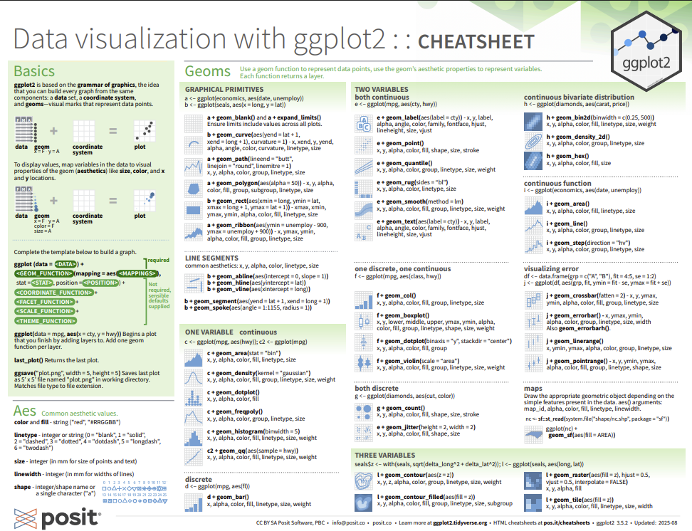

```{r}
#| echo: false
library(ggplot2)
library(palmerpenguins)
data(penguins)
```

## ggplot

[ggplot](https://ggplot2.tidyverse.org) is the most common approach for creating data visualizations with R.

Source: Large parts of this section are adapted from the [first chapter of _R for Data Science_](https://r4ds.hadley.nz/data-visualize).

## ggplot Syntax

Making a data visualization with ggplot starts with

```{r}
#| eval: false
ggplot(data, aes())
```

where `data` is a dataframe and `aes()` describes how columns in the dataframe will be used in the visualization.

## ggplot Aesthetics

For example

```{r}
ggplot(penguins, aes(x = flipper_length_mm, y = body_mass_g))
```

will use the x-axis for `flipper_length_mm` and the y-axis for `body_mass_g`.

## Aesthetics Options

Common aesthetics include:

::: {.columns}

::: {.column width="50%"}
- `x`
- `y`
- `color`
:::

::: {.column width="50%"}
- `fill`
- `shape`
- `size`
:::

:::

You can read more about aesthetics in the ggplot documentation [here](https://ggplot2.tidyverse.org/reference/index.html#aesthetics).

## Grammar of Graphics

The core idea behind ggplot is that plots are composed by combining components such as data, coordinate systems, and geometries (using `+`). This makes it easy to iterately make data visualizations and keeps the syntax consistent between different kinds of plots.

## Geometries

The next step in making a plot with ggplot is choosing how to visualize the data. We'll start with a scatter plot.

With ggplot, these choices always start with "`geom_`".

## Geometries

```{r}
ggplot(penguins, aes(x = body_mass_g, y = flipper_length_mm)) +
  geom_point()
```

## Geometries

```{r}
ggplot(penguins, aes(x = body_mass_g, y = flipper_length_mm, color = species)) +
  geom_point()
```

## Geometries

```{r}
ggplot(penguins, aes(x = body_mass_g, y = flipper_length_mm, color = island)) +
  geom_point()
```

## Geometry Options

Some of the most common geometries are

::: {.columns}

::: {.column width="50%"}
- `geom_point()`
- `geom_line()`
- `geom_bar()`
- `geom_col()`
:::

::: {.column width="50%"}
- `geom_histogram()`
- `geom_density()`
- `geom_label()`
- `geom_smooth()`
:::

:::

You can read about all the geometries [here](https://ggplot2.tidyverse.org/reference/index.html#geoms).

## `geom_bar()` Example

```{r}
ggplot(penguins, aes(x = species)) +
  geom_bar()
```

## Second `geom_bar()` Example

```{r}
ggplot(penguins, aes(x = island, fill = species)) +
  geom_bar()
```

## `geom_bar()` versus `geom_col()`

`geom_bar()` only takes an x-axis in `aes()` and uses the number of rows for the y-axis.

In contrast, `geom_col()` takes a y-axis argument.

## `geom_histogram()`

`geom_histogram()` produces a histogram which visualizes the distribution of a variable/column. Histograms place values into bins (e.g. dividing 0 to 99 into 0-9, 10-19, 20-29... 90-99). The bins are the x-axis and the count of items in each bin is the y-axis.

## `geom_histogram()` Example

```{r}
ggplot(penguins, aes(x = body_mass_g, fill = species)) +
  geom_histogram()
```

## `geom_density()`

`geom_density()` is another visualization of the distribution of a variable/column. You can think of it as something like a smoothed out histogram.

## `geom_density()` Example

```{r}
ggplot(penguins, aes(x = body_mass_g, fill = species)) +
  geom_density(alpha = 0.5)
```

## `geom_smooth()`

`geom_smooth()` adds lines of best fit to the plot. `geom_smooth(method = "lm")` finds the line of best fit with a linear regression (if you don't know what that is, don't worry--it will be covered in Math for Data Science).

## `geom_smooth()` Example

```{r}
ggplot(penguins, aes(x = body_mass_g, y = flipper_length_mm, color = species)) +
  geom_point() +
  geom_smooth(method = "lm", se = FALSE) # linear regression
```

## Labels

You can label your plot with `labs()` like

```{r}
#| eval: false
labs(
    title = "The plot title",
    x = "The x-axis label",
    y = "The y=axis label",
    caption = "The plot caption"
)
```

## Example of Labels

```{r}
#| eval: false
ggplot(penguins, aes(x = body_mass_g, y = flipper_length_mm, color = species)) +
  geom_point() +
  geom_smooth(method = "lm", se = FALSE) +
  labs(
    title = "Relationship Between Body Mass and Flipper Length of Penguins",
    x = "Body Mass (grams)",
    y = "Flipper Length (mm)",
    caption = "Body mass and flipper length are positively correlated for all three species of penguin"
  )
```

## Example of Labels

```{r}
#| echo: false
ggplot(penguins, aes(x = body_mass_g, y = flipper_length_mm, color = species)) +
  geom_point() +
  geom_smooth(method = "lm", se = FALSE) +
  labs(
    title = "Relationship Between Body Mass and Flipper Length of Penguins",
    x = "Body Mass (grams)",
    y = "Flipper Length (mm)",
    color = "Species",
    caption = "Body mass and flipper length are positively correlated for all three species of penguin"
  )
```

## Themes

You can change the appearance of ggplot figures using themes. Complete themes start with `theme_`. You can also adjust the individual theme components with `theme()`.

## Theming Example

```{r}
#| eval: false
ggplot(penguins, aes(x = body_mass_g, y = flipper_length_mm, color = species)) +
  geom_point() +
  geom_smooth(method = "lm", se = FALSE) +
  labs(
    title = "Relationship Between Body Mass and Flipper Length of Penguins",
    x = "Body Mass (grams)",
    y = "Flipper Length (mm)",
    color = "Species",
    caption = "Body mass and flipper length are positively correlated for all three species of penguin"
  ) +
  theme_minimal() +
  theme(panel.grid.minor = element_blank())
```

## Theming Example

```{r}
#| echo: false
ggplot(penguins, aes(x = body_mass_g, y = flipper_length_mm, color = species)) +
  geom_point() +
  geom_smooth(method = "lm", se = FALSE) +
  labs(
    title = "Relationship Between Body Mass and Flipper Length of Penguins",
    x = "Body Mass (grams)",
    y = "Flipper Length (mm)",
    color = "Species",
    caption = "Body mass and flipper length are positively correlated for all three species of penguin"
  ) +
  theme_minimal() +
  theme(panel.grid.minor = element_blank())
```


## `geom_`...what?


 
## Experiment

Let's take some time and practice making various plots. You can use the penguins dataset or try

- `iris`: Data on the length and width of the sepal and flower of three species of Iris plants.
- `Titanic`: Survival status of passengers on the Titantic by class, sex, and age.
- `trees`: The girth, height, and volume of 31 trees.

You can read about all the datasets built into R with `?datasets`.

## Showcase

https://rustpad.io/#s5yUfk